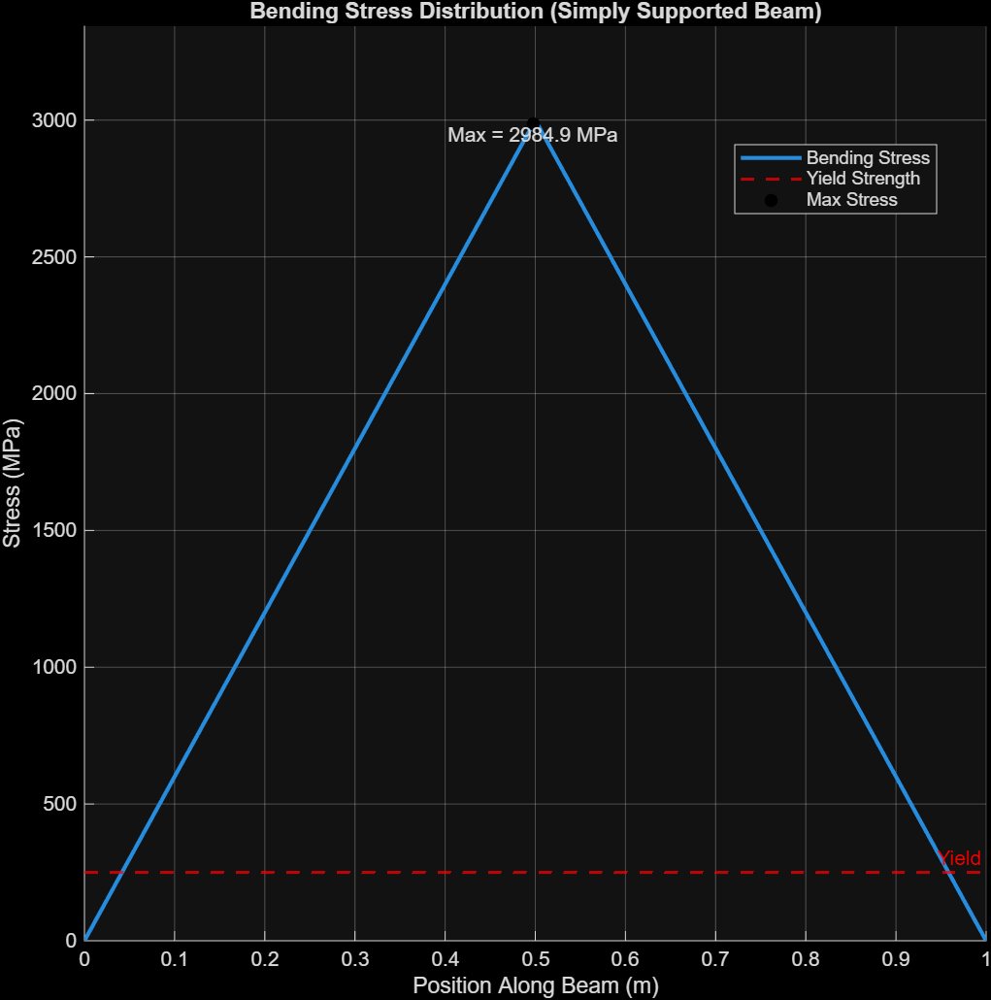

# Beam Stress Analysis (MATLAB)

## Overview
This project models the bending stress distribution in a simply supported beam under a central point load using MATLAB and evaluates structural safety relative to material yield strength.

## Problem Setup
- Beam type: Simply supported beam
- Length: 1 m
- Load: 2000 N at center
- Cross-section: 0.01 m x 0.01 m
- Material: Steel
- Young's modulus: 200 GPa
- Yield strength used for comparison: 250 MPa

## Method
- Calculated support reactions using static equilibrium
- Computed bending moment along the beam
- Converted bending moment to bending stress using σ = Mc/I
- Visualized stress distribution along the beam

## Results
- Maximum bending stress occurs at the center of the beam
- Peak stress is approximately 3000 MPa
- This exceeds the assumed steel yield strength (250 MPa), indicating the beam would fail under the applied load
  
## Visualization

## Key Takeaways
- Maximum bending moment occurs at midspan for a center point load
- Stress is zero at the supports and highest at the center
- Beam dimensions and loading strongly affect structural safety

## Future Improvements
- Add deflection analysis
- Test different load cases
- Compare analytical and numerical results
