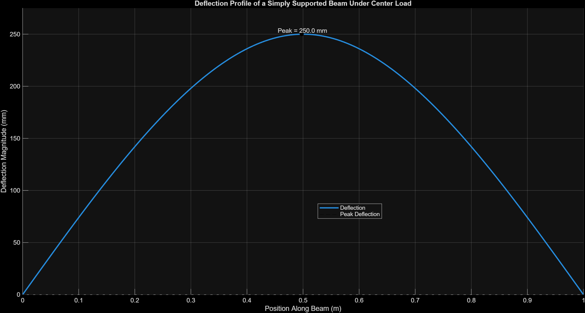

# Beam Stress Analysis (MATLAB)

## Overview
This project models bending stress and deflection in a simply supported beam under a central point load using MATLAB and evaluates structural performance relative to material yield strength.

## Problem Setup
- Beam type: Simply supported beam
- Length: 1 m
- Load: 2000 N at center
- Cross-section: 0.01 m x 0.01 m
- Material: Steel
- Young's modulus: 200 GPa
- Yield strength used for comparison: 250 MPa

## Method
- Calculated support reactions using static equilibrium
- Computed bending moment along the beam
- Converted bending moment to bending stress using σ = Mc/I
- Visualized stress and deflection distributions along the beam
- Computed beam deflection using analytical beam equations

## Results
- Maximum bending stress occurs at the center of the beam
- Peak stress is approximately 3000 MPa
- This exceeds the assumed steel yield strength (250 MPa), indicating structural failure
- Maximum deflection occurs at the center (~250 mm), indicating large deformation and violation of small-deflection assumptions
  
## Visualization

### Stress Distribution

### Deflection Profile

## Key Takeaways
- Maximum bending moment occurs at midspan for a center point load
- Stress is zero at the supports and highest at the center
- Beam dimensions and loading strongly affect structural safety
- Large deflection indicates the beam is too flexible for the given load

## Future Improvements
- Analyze additional loading conditions (distributed loads, multiple point loads)
- Perform parametric analysis on beam dimensions and material properties
- Compare analytical results with numerical methods (e.g., finite difference or FEA)
- Extend the model to include shear deformation and large deflection effects
